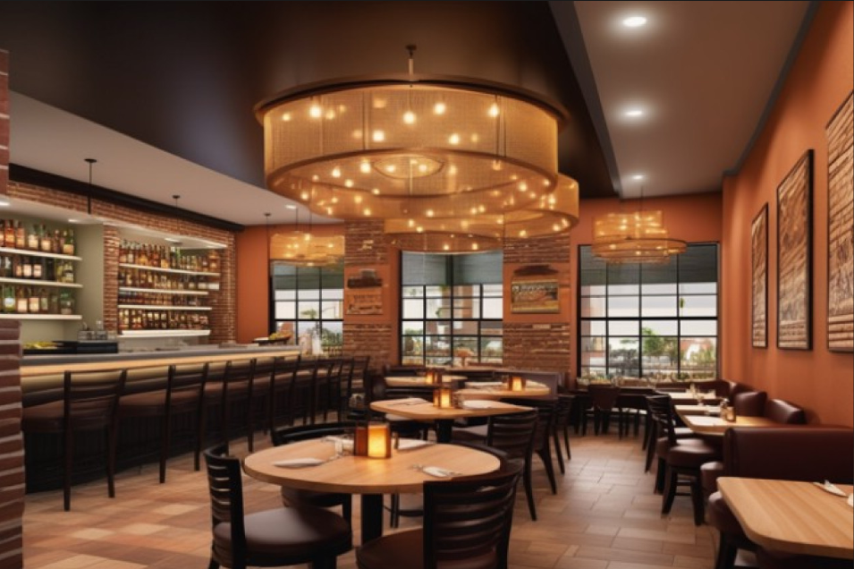
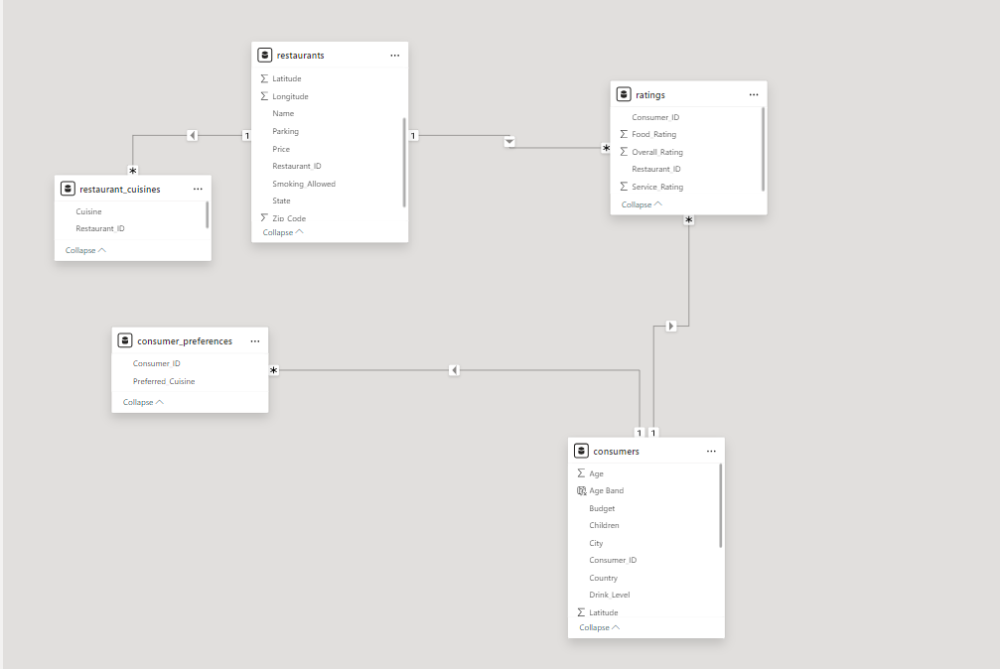
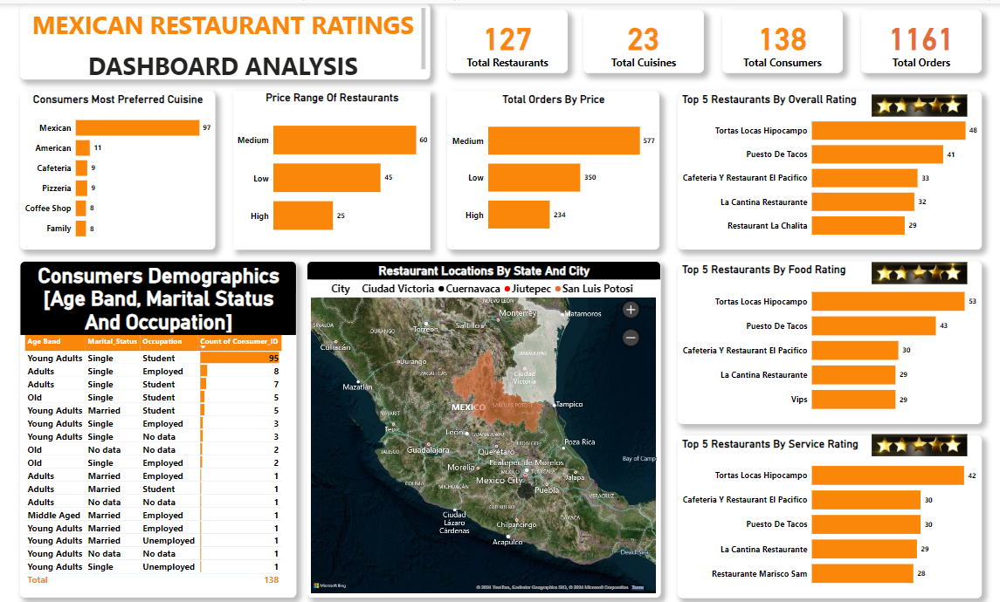

# Mexican-Restaurant-Business-Investment-Case-Study

## Introduction
This is a power BI project on ratings analysis of restaurants in
mexico. This project is to  analyze and draw out meaningful insights from the dataset which
would aid business entrepreneurs and investors in making more informed decisions.

**_Disclaimer_**: This dataset and report is for my final capstone project on my data analytics training to demonstrate my capabilities on power BI. 

## Problem statement:
- Question1: What can you learn from the highest rated restaurants? Do consumer preferences have an effect on
ratings?
- Question2: What are the consumer demographics? Does this indicate a bias in the data sample?
- Question3: Are there any demand & supply gaps that you can exploit in the market?
- Question4: If you were to invest in a restaurant, which characteristics would you be looking for?

## Skills/concept demonstrated:
The following power Bi features were incorporated;
- Data Cleaning and Transformation
- Modelling
- DAX
- Measures
- Data Visualization
- Problem Solving

## Tool used:
- Power BI

## Modelling:
Automatically derived relationships were used as they matched the required relationships.
Auto Model
:---------------------------------------------------:
     

This model is a star schema.
There are 4 dimension tables and 1 fact table. The dimension tables are all joined to the fact table with a one to many relationships

## Visualization:
The report comprises 6 key insights:
- 1:Highest rated restaurants by (Food, services  and overall ratings)
- 2:Highest rated cuisine
- 3:Consumer demographics
- 4:Price range of restaurants
- 5:Total orders by price
- 6:Restaurant locations map by states and cities

You can interact with the report here [https://app.powerbi.com/view?r=eyJrIjoiNjdmNjQzNjYtNDZhNC00Njg5LThmM2YtOTY4ZTlmYTE0ODFlIiwidCI6IjE4MTk3OTFkLTFhZjUtNDZiMC1iNDQ3LWFiYWMwMzVjZjQzYiJ9](https://app.powerbi.com/view?r=eyJrIjoiNjdmNjQzNjYtNDZhNC00Njg5LThmM2YtOTY4ZTlmYTE0ODFlIiwidCI6IjE4MTk3OTFkLTFhZjUtNDZiMC1iNDQ3LWFiYWMwMzVjZjQzYiJ9)

## Measures:
This dashboard analysis reported a total of 127 restaurants, a total of 23 cuisines and a total of 138 consumers and a total of 1,161 orders.

## Recommended analysis:
### Question1: 
- It can be observed that the highest rated restaurant in food is also the highest rated restaurant in services thus overall, but the 2nd most rated restaurant in food is not the 2nd most rated restaurant in services same as the 3rd most rated.
- This indicated that consumer preferences have an effect on
ratings as some prefered the food and not the services while some prefered the services and not the food and others both.
- Also the highest rated cuisine is mexican which also indicated that the consumers prefered their native dishes more as they are mexicans.

### Question2: The consumer demographics are by; 
- Age band:
  Young Adults (18-25)
  Adults (26-45)
  Middle Aged (46-65)
  Old (65 and above)
- Marital status:
  Singles and married
- Occupation:
  Students, employed and unemployed.

- And this does not indicate bias in the data sample as there were no prejudice for or against any age band, status or occupation category; especially in a way to be considered to be unfair.
- Although the report showed that a higher percentage of their customers were young adults (18-25) and students which i think now explains why they are single 😄.

### Question3: All things being equal, the law of demand states that the higher the price the lower the quantity demanded and vice versa.
- But in this report it can be noted that at a high price range the restaurants did not record the lowest orders and and at a low price range they did not record the highest orders either but rather the price range of the restaurants and the highest orders by the consumers are at equilibrum on meduim.

### Question4: If I were to invest in a restaurant, the characteristics I would be looking for are:
- Restaurants that sell mexican cuisine are restaurants that have market dominance. Therefore, I would invest in restaurants that sell mexican cuisine.
- Also, a higher percentage of their customers were young adults (18-25), students and single. Therefore, I would invest in restaurants whose consumers are more of this categories.

## Conclusion:
Navigating the features of Power BI was challenging at first but the end result was rewarding 😊 .
